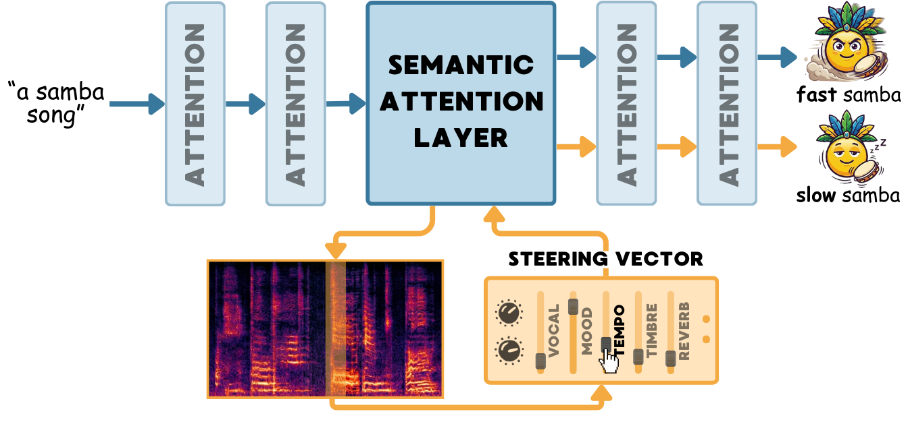

# <h1 align="center">TADA! 🎉 Tuning Audio Diffusion Models through Activation Steering</h1>

<div align="center">

[](https://arxiv.org/abs/2602.11910) [](https://audio-steering.github.io/) 
</div>


Audio diffusion models can synthesize high-fidelity music from text, yet their internal mechanisms for representing high-level concepts remain poorly understood. In this work, we use activation patching to demonstrate that distinct semantic musical concepts, such as the presence of specific instruments, vocals, or genre characteristics, are controlled by a small, shared subset of attention layers in state-of-the-art audio diffusion architectures. Next, we demonstrate that applying Contrastive Activation Addition and Sparse Autoencoders in these layers enables more precise control over the generated audio, indicating a direct benefit of the specialization phenomenon. By steering activations of the identified layers, we can alter specific musical elements with high precision, such as modulating tempo or changing a track's mood.


<div align='center'>

</div>

## 🔥 Updates
- [x] Code released
- [ ] Release SAEs and Steering Vectors

## ⚙️ Environment Setup

Create a virtual environment (python >= 3.10) and install dependencies:
```bash
python3 -m venv venv
source venv/bin/activate
pip install -r requirements/requirements_1.txt
pip install -r requirements/requirements_2.txt --no-deps
```

## 📁 Repository Structure

```
├── src/                                # localization code
│   ├── models/
│   ├── patch_layers.py                 # run activation patching
│   ├── preprocess/                     # prepare datasets for localization
│   └── postprocess/                    # Results collection & visualization
│
├── steering/ace_steer/                 # CAA, eval steering
│   ├── compute_steering_vectors_caa.py #   Compute CAA vectors from prompt pairs
│   ├── eval_steering_vectors.py        #   Evaluate with MUQ-T
│   └── eval_steering_protocol.py       #   Full evaluation protocol
│
├── sae/                                # Sparse Autoencoder pipeline
│   └── sae_src/
│       ├── sae/                        #   SAE model, trainer, activation caching
│       ├── hooked_model/               #   Hooks for ACE-Step, AudioLDM2, Stable Audio
│       └── configs/                    #   Concept prompts & eval configs
│
├── editing/                            # evaluation (LPAPS, CLAP, MULan)
├── configs/                            # configs for patching
└── scripts/                            # bash/SLURM scripts
    ├── localization/                   #   patching & ablation jobs
    └── steering/                       #   CAA & SAE steering jobs
```

## 🔍 Activation Patching

Localize where musical concepts are processed across transformer layers by patching activations from one generation into another:

```bash
# Patch a single layer of ACE-Step (via Hydra config)
accelerate launch --num_processes 4 src/patch_layers.py \
    experiment=patch_ace/ace_drums \
    patch_layers=ace/tf7 \
    patch_config.path_with_results=outputs/ace/patching/drums/tf7

# Run all layers x features on SLURM
sh scripts/localization/patching/patch_ace_helios.sh
```

+ Supported features: `drums`, `fast`, `female`, `happy`, `male`, `sad`, `slow`, `violin`
+ Supported models: ACE-Step, AudioLDM2, Stable Audio

## 🎛️ Steering Vectors (CAA)

Compute contrastive activation addition vectors from prompt pairs and apply them at inference with a scalar multiplier:

```bash
# Compute steering vectors
python steering/ace_steer/compute_steering_vectors_caa.py \
    --concept piano \
    --num_inference_steps 30 \
    --save_dir steering_vectors

# Evaluate across alpha values and layer configurations
python steering/ace_steer/eval_steering_vectors.py \
    --sv_path steering_vectors/ace_piano_passes2_allTrue \
    --concept piano \
    --layers tf7 \
    --steer_mode cond_only

# Full evaluation protocol (CLAP, MUQ-T, LPAPS, FAD, aesthetics)
python steering/ace_steer/eval_steering_protocol.py \
    --steering_dir /path/to/outputs \
    --eval_prompt "piano music"
```
+ **Steering modes**: `cond_only` (default), `separate`, `both_cond`, `uncond_only`
+ **Layer selection**: `tf6`, `tf7` (most effective), `tf6tf7`, `all`, `no_tf6tf7`
+ **Alpha range**: `[-100, -90, ..., -5, -1, 0, 1, 5, ..., 90, 100]`

## 🧠 Sparse Autoencoders

Train SAEs on cached activations for feature-level interpretability, then use learned features for targeted steering:

```bash
# Cache activations from model
python sae/sae_src/sae/cache_activations_runner_ace.py

# Train SAE
python sae/sae_src/scripts/train_ace.py

# Evaluate SAE-based steering
python sae/scripts/eval_sae_steering.py \
    --concept piano \
    --sae_path /path/to/sae/checkpoint \
    --selection_method tfidf \
    --top_k 20
```

## 📚 Citation

```bibtex
@misc{staniszewski2026tada,
      title={TADA! Tuning Audio Diffusion Models through Activation Steering}, 
      author={Łukasz Staniszewski and Katarzyna Zaleska and Mateusz Modrzejewski and Kamil Deja},
      year={2026},
      eprint={2602.11910},
      archivePrefix={arXiv},
      primaryClass={cs.SD},
      url={https://arxiv.org/abs/2602.11910}, 
}
```

## 🙏 Credits

This repository builds on [ACE-Step](https://github.com/ace-step/ACE-Step), [DDPM Inversion for Audio](https://github.com/HilaManor/AudioEditingCode), [CASteer](https://github.com/Atmyre/CASteer), and [Universal DiffSAE](https://github.com/cywinski/universal-diffsae).
